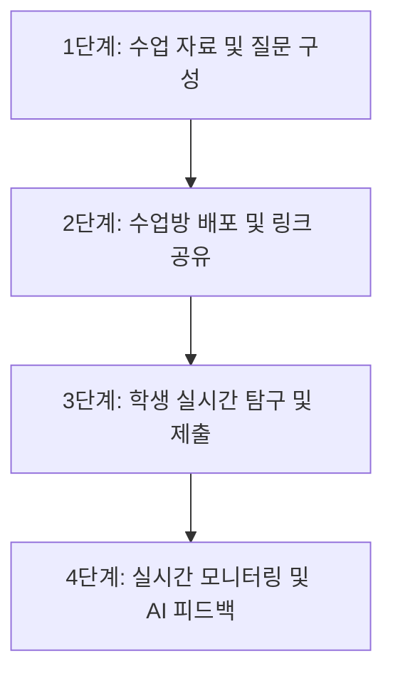

# 🚀 실시간 탐구 학습지 생성기 (i wanna Dash ⛷️)

> **Vite와 Firebase SDK v10 및 Google Gemini AI를 활용한 실시간 탐구 활동지 생성 및 모니터링 플랫폼**  
> 교사가 웹 시뮬레이션(GeoGebra, PhET 등)과 탐구 질문을 연동하여 실시간으로 학습지를 생성하고, 학생의 제출 데이터를 실시간 대시보드와 Gemini AI 피드백을 통해 통합 관리하는 솔루션입니다.

---

## 🌟 주요 기능

1. **실시간 학습지 생성 및 연동**:
   - 외부 웹 시뮬레이션 URL(GeoGebra, PhET, Scratch 등) 연동 또는 단일 HTML 파일 업로드 방식 지원.
   - 주관식/객관식 맞춤형 탐구 질문 설계 및 교사용 고유 ID 설정 가능.
2. **학생용 실시간 탐구/필기 및 제출**:
   - 시뮬레이션 위에 오버레이된 캔버스 드로잉(펜/지우개/투명도/두께 조절) 기능 제공.
   - Screen Capture API(화면/탭 캡처) 및 html2canvas 기반 자동 캡처 첨부, 최대 500KB의 개별 파일 업로드 기능 지원.
   - 복사/붙여넣기 횟수 및 텍스트 세그먼트 기록을 통한 표절/치팅 실시간 모니터링.
3. **교사용 실시간 모니터링 대시보드**:
   - Firestore 실시간 리스너(`onSnapshot`)를 활용한 실시간 제출 현황(학번순 정렬).
   - 비정상적인 답안 복사-붙여넣기 이력 감지 및 하이라이트 표시.
   - 전체 학생 제출 데이터의 엑셀 호환 CSV 리포트 다운로드(UTF-8 BOM으로 한글 깨짐 방지) 및 데이터 안전 초기화.
4. **Google Gemini AI 연동 피드백**:
   - Cloud Functions를 통해 `gemini-1.5-flash` 모델을 호출하여, 학생의 관찰/추론 내용에 맞는 1~2문장의 발문형 힌트 피드백 실시간 전송.

---

## 📖 서비스 작동 순서 & 핵심기능 가이드

### 1단계: 수업 자료 및 질문 구성 (교사)
교사가 수업에 활용할 교안자료와 질문들을 맞춤형으로 설정합니다.
* **핵심 기능**:
  * **자료 다양화 (최대 10개)**: HTML 시뮬레이션, PDF 교안, 이미지, 외부 URL 링크를 탭 또는 분할 레이아웃으로 결합.
  * **자유로운 문항 설계**: 주관식 서술형 및 선택지 기반의 객관식 문항 맞춤 생성.
  * **학습 추적 옵션**: 개별 자료 전용 독립 필기판 판서 모드, 소요시간 타이머 설정 지원.
  * **수업방 ID 설정**: 영문/숫자/하이픈 기반의 직관적인 ID 입력.

### 2단계: 수업방 배포 및 링크 공유 (교사)
생성한 방을 클라우드에 배포하고 접속 주소를 전달합니다.
* **핵심 기능**:
  * **QR 코드 자동 변환**: 모바일/태블릿 등 장비에서 QR 카메라 조작만으로 초간편 즉각 입장.
  * **보안 링크 이중 관리**: 학생용 탐구 활동지 링크와 교사 전용 실시간 결과 모니터링 주소 복사 제공.

### 3단계: 학생 실시간 탐구 및 제출 (학생)
공유받은 링크에 들어가 탐구 보고서를 완성합니다.
* **핵심 기능**:
  * **모바일 최적화 접기/펴기**: 기기 회전(가로/세로) 방향에 맞추어 레이아웃이 유연하게 반응하며 펴고 접힘.
  * **실시간 타이머**: 본인의 풀이 경과 시간을 스스로 보며 속도 조절 가능.
  * **화면 드로잉 캡처**: 시뮬레이션 필기판 위 그리기 이력이 답안 제출 시 스크린샷으로 함께 자동 자동 제출.

### 4단계: 실시간 모니터링 및 AI 피드백 (교사 & 학생)
제출 결과를 즉각 수집하고 개별 코칭을 진행합니다.
* **핵심 기능**:
  * **실시간 대시보드 피드**: 새로고침 없이 학생 학번/이름/답안/캡처/소요시간 정보가 즉각 적재됨.
  * **Gemini AI 자동 힌트**: 학생이 제출하면 기재된 텍스트 흐름을 보고 AI 튜터가 발문형 피드백을 노출.
  * **엑셀용 CSV 다운로드**: 수업 결과를 정량적으로 평가할 수 있도록 엑셀 보고서 다운로드 및 초기화 지원.

---

## 🔄 업데이트 내역 (Update History)
### 📑 다중 파일 업로드 및 자동 라우팅 UI/UX 구현 (2026-08-02)
- **다중 파일 수업 밀키트**: 최대 10개 파일 (PDF, 이미지, HTML) 동시 업로드 및 Firebase Storage 연동.
- **탭 이름 사용자 지정**: 업로드한 파일별로 탭 이름을 지정하고, 교체 시 탭 이름 및 순서 유지.
- **화면 레이아웃 자동 분기**: 파일 개수에 따른 최적의 레이아웃(상단 탭, 드래그 다단 분할 Resizer, 상하 연속 스크롤) 지원.
- **독립/글로벌 캔버스 필기**: 탭/페이지별 독립 판서 또는 글로벌 판서 모드 선택 가능.
- **상대 좌표 판서 시스템**: Resizer 조작으로 뷰어 폭이 변경되어도 판서 위치가 해당 파일의 상대 위치에 맞춰 1:1 유지되도록 드로잉 시스템 개선.